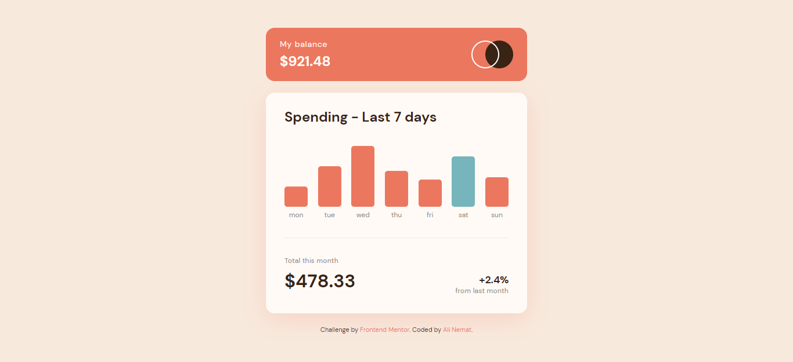

# Frontend Mentor - Expenses chart component solution

This is a solution to the [Expenses chart component challenge on Frontend Mentor](https://www.frontendmentor.io/challenges/expenses-chart-component-e7yJBUdjwt). Frontend Mentor challenges help you improve your coding skills by building realistic projects. 

## Table of contents

- [Overview](#overview)
  - [The challenge](#the-challenge)
  - [Screenshot](#screenshot)
  - [Links](#links)
- [My process](#my-process)
  - [Built with](#built-with)
  - [What I learned](#what-i-learned)
  - [Continued development](#continued-development)
  - [Useful resources](#useful-resources)
- [Author](#author)

## Overview

### The challenge

Users should be able to:

- View the bar chart and hover over the individual bars to see the correct amounts for each day
- See the current day’s bar highlighted in a different colour to the other bars
- View the optimal layout for the content depending on their device’s screen size
- See hover states for all interactive elements on the page
- **Bonus**: Use the JSON data file provided to dynamically size the bars on the chart

### Screenshot



### Links

- Live Site URL: [Check it Online (Click!)](https://alinematt.github.io/Expenses-chart-component)

## My process

### Built with

- Semantic HTML5 markup
- CSS custom properties
- Flexbox
- Vanilla Js

### What I learned

  In this challenge, I learned how to use a local JSON file and how to get the name of day in short string form!
```JS
function dayCheck(date = new Date, local = "en-IR") {
      return date.toLocaleDateString(local, {weekday: 'short'});
    }
```


### Continued development

in future projects, I'm going to focus on optimize usage of HTML/CSS & write a better code! furthermore I'll try to find better & faster algorithems in JavaScript!


### Useful resources

- [Rajdeep Singh](https://officialrajdeepsingh.dev/read-locally-json-file-use-fetch-method-in-javascript/) - This helped me how to fetch a local json file in JavaScript


## Author

- Website - [Ali Nemat](https://www.alinemat.ir)
- Frontend Mentor - [@AliNematt](https://www.frontendmentor.io/profile/AliNematt)
- Instagram - [@alinemat.ir](https://www.instagram.com/alinemat.ir)